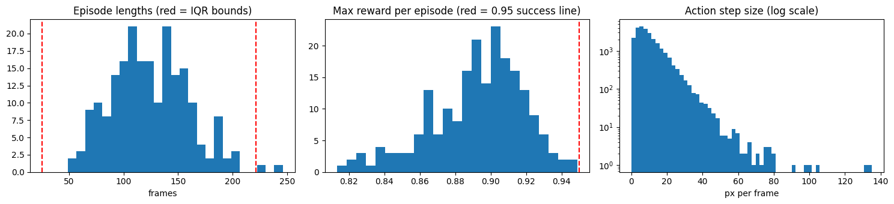
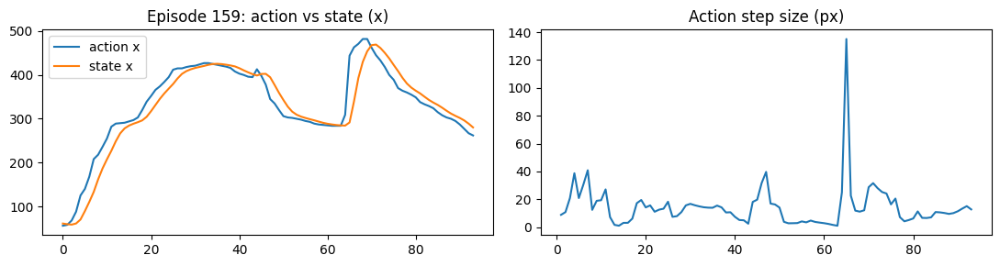

# Robot Dataset Quality Checker

A Python tool that audits robot demonstration datasets in [LeRobot](https://github.com/huggingface/lerobot) format for structural and behavioral quality issues. I built it to learn how robot data is structured and to practice finding the kinds of problems that make training data misleading.

Demonstrated on [`lerobot/pusht`](https://huggingface.co/datasets/lerobot/pusht): 206 episodes, 25,650 frames, 10 fps, a 2D robot pushing a T-shaped block to a target.

## Findings on `lerobot/pusht`

*Left: episode lengths with IQR outlier bounds. Middle: the highest reward reached in each episode, with the 0.95 success line. Right: per-frame action step size (log scale).*

- **No structural errors.** Frame counts, index continuity, timestamps vs. fps, NaN/inf values, frame ordering and metadata agreement all pass.
- **`next.done` is set on the last two frames of every episode.** This is a consistent quirk of the dataset, and the checks are written to expect it.
- **26 large action jumps across 22 episodes** (up to 135 px per frame in a 512 px space). In every case the robot state moved at least as far as the jump within 5 frames, so these look like fast human moves, not data glitches. A few are on consecutive frames (e.g. episodes 107 and 120), probably one fast move split across frames.

*Episode 159, the largest jump. The state follows the action after the spike, so this is a fast move, not a glitch.*

- **2 mild length outliers:** episodes 174 and 184 (246 and 229 frames, against a median of 122).
- **`next.success` is never True, and no episode reaches the documented 95% coverage threshold at any frame** (max reward 0.949). The success and reward columns therefore can't be used to separate successful from unsuccessful demonstrations. I did not determine the cause. One untested possibility is that episodes end as success is reached and the reward is recorded a step late.

All flagged items are saved in [`issues.csv`](issues.csv) with a severity level.

## What it checks

| Level | Check | What it catches |
|---|---|---|
| error | frame count, global index, episode ids | missing or duplicated data |
| error | per-episode length vs. metadata | metadata that disagrees with the data |
| error | frame index, timestamps vs. 1/fps | reordering, dropped frames, timing drift |
| error | NaN / inf in state and action | corrupted values |
| error | done-flag placement | broken episode boundaries |
| error | static action | episodes where the robot never moved |
| warning | success never True | labels that can't be used for filtering |
| warning | action jump the state did not follow | possible command or recording glitches |
| info | action jump the state did follow | fast moves, kept for transparency |
| info | length outliers (IQR rule) | unusually long or short demonstrations |

## Mistakes I made while building this

My first version of the done-flag check assumed `next.done` is True only on the final frame. It flagged 206 of 206 episodes. A check that fires on everything is almost always the check that's wrong, so I inspected the flags directly, found they sit on the last two frames, and corrected the rule. I also changed the jump check from a plain percentile threshold, which flags a fixed share of frames by construction, to one that tests whether the robot state actually followed the command.

## How to run

1. Open [`explore_dataset.ipynb`](https://colab.research.google.com/github/Ragul2526/robot-dataset-quality-checker/blob/main/explore_dataset.ipynb) in Google Colab.
2. Run the cells in order. The notebook downloads only the metadata and the data table, not the video.
3. Results are printed and written to `issues.csv`.

## Limitations

- Tested on one dataset with low-dimensional (2D) state.
- Video frames are not checked yet.
- Thresholds (IQR bounds, jump size) are heuristics and would need tuning for other robots.
- The "state followed" test is loose: it compares state movement over the next 5 frames to the jump size, and ratios above 100% (up to 288% here) mean ordinary motion is mixed in. It separates "state ignored the command" from "state responded", but it is not a precise measure of tracking.
- The checks assume LeRobot v3.0 file layout and column names.

## Next steps

- Add video checks (dropped or frozen frames, frame-count agreement with the data table).
- Run the same checks on other LeRobot datasets with more state dimensions to see which rules generalize.

## Credits

- Dataset: [lerobot/pusht](https://huggingface.co/datasets/lerobot/pusht) on
  Hugging Face, in [LeRobot](https://github.com/huggingface/lerobot) format.
- The PushT task and demonstrations come from the Diffusion Policy work
  (Chi et al.); the gym environment is
  [gym-pusht](https://github.com/huggingface/gym-pusht).
- I did not create this data. This repo only contains my quality-checking code
  and analysis of it.
